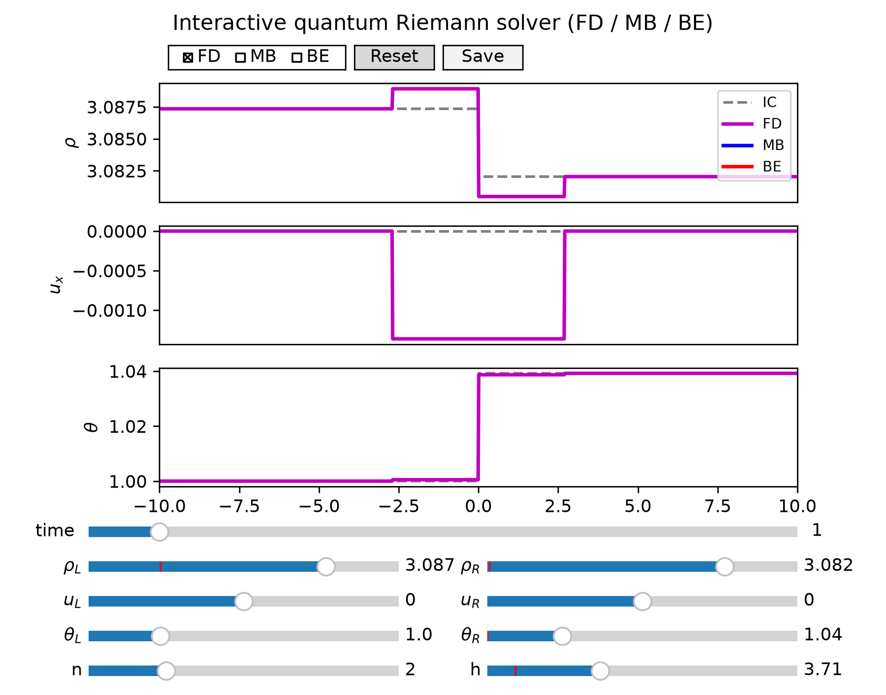
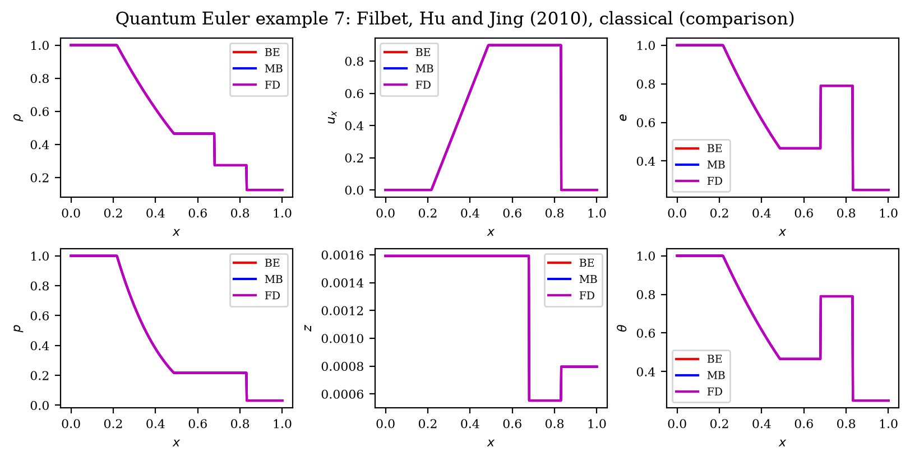
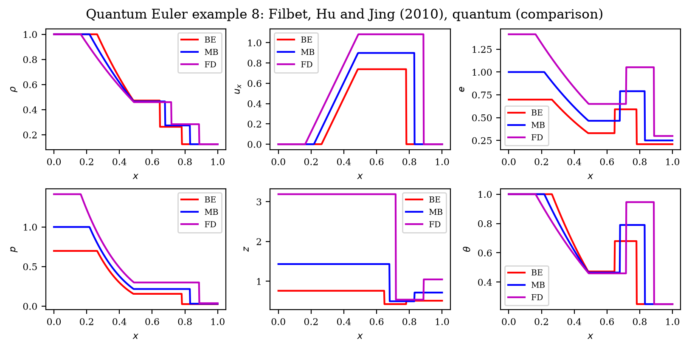

# Classical and Quantum Ideal Gases

Exact Riemann solvers for classical and quantum Euler gases, with a fast polylogarithm kernel used to resolve the quantum equation of state.

This repository ports the MATLAB implementation found in [this thesis](https://doi.org/10.6342/NTU.2015.00509) to Python 3.11. The polylog function has been ported from the MATLAB implementation to C++ and the Toro exact Riemann solver has been extended to support Fermi–Dirac (FD), Bose–Einstein (BE), and Maxwell–Boltzmann (MB) statistics.

## Requirements

- Python 3.11+
- [pip](https://pip.pypa.io/) (or [uv](https://docs.astral.sh/uv/))

Building from source additionally requires a C++17 compiler. See [DEVELOPER_GUIDE.md](DEVELOPER_GUIDE.md).

## Installation

```bash
pip install ideal-gases
```

For plotting (`euler plot`, interactive explorers):

```bash
pip install ideal-gases[plot]
```

After install, the `euler` command-line tool is available.

## Interactive mode

Launch matplotlib widget explorers to build custom Riemann problems with sliders, statistic toggles (quantum), and Save/Reset controls. Y-axis limits autoscale automatically on each update.

```bash
euler interactive classical
euler interactive quantum
```

Seed the initial state from CLI flags or a JSON config (same fields as `euler solve`):

```bash
euler interactive classical --gamma 1.4 --t-end 0.5 --nx 101
euler interactive quantum --rho-l 2 --t-l 1.5 --n 3 --h 0.5
euler interactive classical --config case.json
```

Optional domain flags (`--x-min`, `--x-max`, `--x0`, `--nx`) default to an interactive Sod-tube layout (`x` in `[-10, 10]`, discontinuity at `x0=0`, `nx=1024`). Use `-f path.png` to set the **Save** button target; nothing is written until you click Save.

### Example usage

```bash
euler interactive quantum
```
Outputs a Sod shock tube problem resolved with a quantum Euler solver for all statistics. We deactivate the solutions of MB and BE to focus on the FD solution. Using the slider, we can vary the left and right states and the thermal scale parameter `h` and the number of degrees of freedom `n` of the gas.

In Fig. 5 of [Hu and Jing (2010)](https://www.researchgate.net/profile/Shi-Jin-5/publication/228568274_On_kinetic_flux_vector_splitting_schemes_for_quantum_Euler_equations/links/02e7e525327fccc0cf000000/On-kinetic-flux-vector-splitting-schemes-for-quantum-Euler-equations.pdf), a fictitious 2-d fermi gas degenerate regime is used to prove the accuracy of Kinetic Flux Vector Splitting schemes for quantum Euler equations. Using the interactive mode, we set `n` : 2 and set the left and right states ($\rho,u,\theta$). Using the `h` slider, we found that the degenerate gas is resolved approximately for `h` $\approx$ 3.71.
As show in the following figure:




## Command-line mode

Compute exact solution profiles, save plots to PNG, and write CSV/JSON files with the solution fields.

### Classical Sod shock tube

```bash
euler solve classical \
  --rho-l 1 --u-l 0 --p-l 1 \
  --rho-r 0.125 --u-r 0 --p-r 0.1 \
  --t-end 0.25 --gamma 1.4 \
  --nx 101 -o sod.csv
```

### Quantum Euler

```bash
euler solve quantum \
  --rho-l 1 --u-l 0 --t-l 1 \
  --rho-r 0.125 --u-r 0 --t-r 0.25 \
  --t-end 0.20 --n 2 --h 0.1 --statistic FD \
  -o euler_fd.csv
```

Write separate files for FD, MB, and BE with `--all-statistics` (e.g. `euler_case7_FD.csv`, `euler_case7_MB.csv`, `euler_case7_BE.csv`):

```bash
euler solve quantum ... --all-statistics -o euler_case7
```

### Built-in benchmarks

```bash
euler toro 1 -o toro_test1.csv
euler list --toro

euler quantum-example 7 --all-statistics -o euler_eg7
euler list --quantum
```

### JSON config files

Define a problem in JSON and run it with `euler run` or pass `--config` to `euler solve`:

```bash
euler run --config case.json
euler solve classical --config case.json -o override.csv
```

Example `case.json`:

```json
{
  "mode": "quantum",
  "left": {"rho": 1.0, "u": 0.0, "theta": 1.0},
  "right": {"rho": 0.125, "u": 0.0, "theta": 0.25},
  "t_end": 0.20,
  "n": 2.0,
  "h": 0.1,
  "statistic": "FD",
  "all_statistics": true,
  "format": "json",
  "output": "euler_case7",
  "domain": {"x_min": 0.0, "x_max": 1.0, "x0": 0.5, "nx": 101}
}
```

Use `--format json` (or a `.json` output path) for JSON instead of CSV. CLI flags override values from the config file.

### Visualization

Save a classical Sod shock tube figure:

```bash
euler plot classical \
  --rho-l 1 --u-l 0 --p-l 1 \
  --rho-r 0.125 --u-r 0 --p-r 0.1 \
  --t-end 0.2 --gamma 1.4 --nx 101 \
  -f sod.png
```

Plot a single quantum statistic or compare FD/MB/BE:

```bash
euler plot quantum \
  --rho-l 1 --u-l 0 --t-l 1 \
  --rho-r 0.125 --u-r 0 --t-r 0.25 \
  --t-end 0.20 --n 2 --h 0.1 --statistic FD \
  -f qfd.png

euler plot quantum-example 7 --all-statistics -f eg7
```

With `--all-statistics`, `-f eg7` writes `eg7_panels.png` (3×6 grid) and `eg7_comparison.png` (overlay). Use `--layout panels|comparison|both` to select one or both (default: `both`). Add `--show` for an interactive window, or `-o` to export CSV/JSON in the same run.

### Example usage

In [Filbet, Hu and Jing (2010)](https://www.cambridge.org/core/journals/esaim-mathematical-modelling-and-numerical-analysis/article/abs/numerical-scheme-for-the-quantum-boltzmann-equation-withstiff-collision-terms/BFB7B0297D8BC201F9A2C9008F4894BC), the authors use a Sod shock tube initial condition with a fictitious 2-d fermi and bose gas to prove the accuracy of their numerical scheme in classical and quantum hydronamic regimes. These are examples 7 and 8, respectively, in the CLI plot tool.

```bash
euler plot quantum-example 7 --all-statistics -f sod_2d_gas_classical --layout comparison --show
```
yields the following plot:


```bash
euler plot quantum-example 8 --all-statistics -f sod_2d_gas_quantum --layout comparison --show
```
yields the following plot:


## Python module

Import `ideal_gases` to compute classical and quantum gas solutions in your own scripts.

### Classical Sod shock tube

```python
import numpy as np
from ideal_gases import classical_gas

x = np.linspace(0.0, 1.0, 101)
result = classical_gas(
    rho_l=1.0,
    u_l=0.0,
    p_l=1.0,
    rho_r=0.125,
    u_r=0.0,
    p_r=0.1,
    t_end=0.2,
    gamma=1.4,
    x=x,
    x0=0.5,
)
```

### Quantum Euler (FD / BE / MB)

Left and right states are given in terms of density `rho`, velocity `u`, and temperature `theta` (written `t` in the API). The solver converts these to effective pressures via the quantum EOS, then applies the Toro exact Riemann solver.

```python
import numpy as np
from ideal_gases import quantum_gas

x = np.linspace(0.0, 1.0, 101)
result = quantum_gas(
    rho_l=1.0,
    u_l=0.0,
    t_l=1.0,
    rho_r=0.125,
    u_r=0.0,
    t_r=0.25,
    t_end=0.20,
    n=2.0,          # degrees of freedom; gamma = (n+2)/n
    h=0.1,          # thermal scale parameter
    statistic="FD", # "FD", "BE", or "MB"
    x=x,
    x0=0.5,
)
```

This returns a `RiemannResult` object that contains the solution fields: `x`, `rho`, `ux`, `p`, `e`, `z` (fugacity), `t` (temperature), `mach`, `entropy`.

In the classical limit, MB statistics with `h → 0` recover the ideal-gas behaviour (pressures `p = rho * theta`).

### Polylogarithm module

The polylogarithm module is used to compute the fermi and bose quantum functions. The current implementation is based on the [Bhagat approximation](https://doi.org/10.1016/S0010-4655(03)00294-7) and Sommerfeld's lemma. Providing up to 6 digits of accuracy for the polylogarithm function for half-integer orders. This is a trade-off between accuracy and performance.
Nevertheless, it is known that this approximation might fail for `z` values very close to 1 (Degenerate limit of Bose gases).

**NOTE:** This is a known issue and the author is working on a more accurate implementation.

We can use the polylogarithm module on our scripts as follows:

```python
import numpy as np
from ideal_gases import polylog

polylog(2, 0.5)                         # scalar
polylog(1.5, np.linspace(0.2, 0.9, 50)) # array
```

We can plot the polylogarithm function to verify the accuracy of the implementation for integer and half-integer orders as follows:

```bash
uv run scripts/plot_polylogarithms.py
```
yields the following plot:


### Public API

```python
from ideal_gases import (
    RiemannResult,
    adiabatic_index,
    classical_gas,
    quantum_gas,
    polylog,
)
```

| Symbol | Role |
|--------|------|
| `polylog(n, z)` | Fast polylogarithm (scalar or NumPy array) |
| `adiabatic_index(n)` | Returns γ = (n + 2) / n |
| `classical_gas(...)` | Classical ideal-gas exact Riemann solver |
| `quantum_gas(...)` | Quantum EOS + Toro exact Riemann solver |
| `RiemannResult` | Solution profiles on the spatial grid |

## License

MIT License. See [LICENSE](LICENSE) for the full text.

Copyright (c) 2026 Manuel A. Diaz

For building from source, tests, linting, CI, and releases, see [DEVELOPER_GUIDE.md](DEVELOPER_GUIDE.md).
