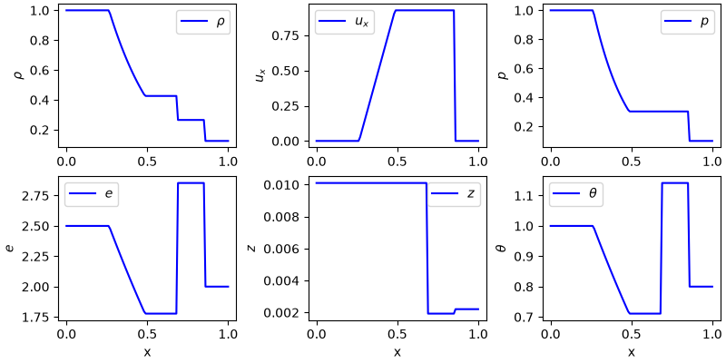
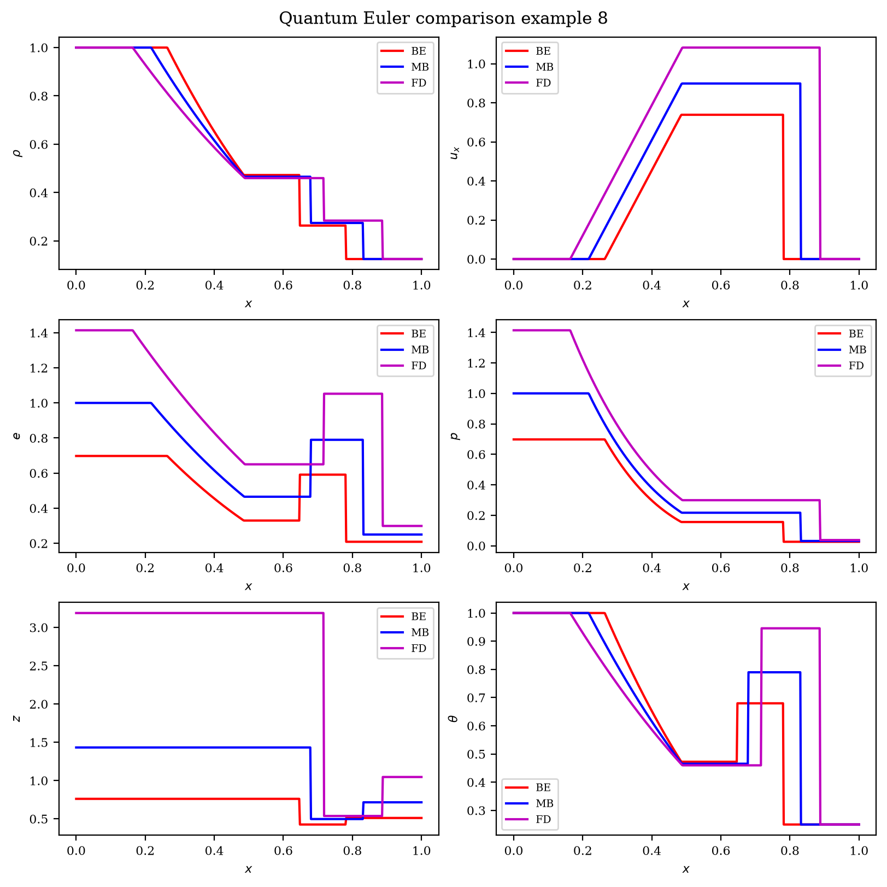
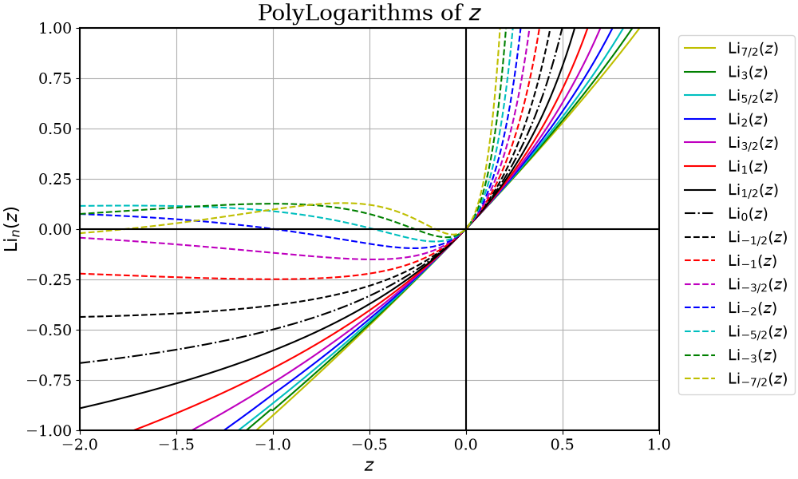

# QEuler

Exact Riemann solvers for classical and quantum Euler gases, with a fast polylogarithm kernel used in the quantum equation of state.

This repository ports the MATLAB reference implementation (Diaz, 2014) to Python. The C++ polylog core and Toro exact Riemann solver support Fermi–Dirac (FD), Bose–Einstein (BE), and Maxwell–Boltzmann (MB) statistics.

## Requirements

- Python 3.14+
- A C++17 compiler (for the pybind11 extension)
- [uv](https://docs.astral.sh/uv/) (recommended) or pip

## Installation

```bash
git clone <repo-url>
cd QEuler
uv sync
```

This installs the `euler` package in editable mode and builds the `_polylog` C++ extension via scikit-build-core.

To include dev tools (pytest, matplotlib, mpmath, ruff):

```bash
uv sync --group dev
```

## Project layout

```
cpp/          C++ polylog library and pybind11 bindings
matlab/       Original MATLAB reference solvers and plotting scripts
scripts/      Python utilities (e.g. solution plots)
src/euler/    Python package
tests/        pytest suite
```

## Quick start

### Classical Sod shock tube

```python
import numpy as np
from euler import euler_gas

x = np.linspace(0.0, 1.0, 101)
result = euler_gas(
    rho_l=1.0,
    u_l=0.0,
    p_l=1.0,
    rho_r=0.125,
    u_r=0.0,
    p_r=0.1,
    t_end=0.2,
    gamma=1.4,
    x=x,
    x0=0.5,
)
```

Using `matplotlib`, the results can be plotted as follows:



### Quantum Euler (FD / BE / MB)

Left and right states are given in terms of density `rho`, velocity `u`, and temperature `theta` (written `t` in the API). The solver converts these to effective pressures via the quantum EOS, then applies the Toro exact Riemann solver.

```python
import numpy as np
from euler import quantum_euler_gas

x = np.linspace(0.0, 1.0, 101)
result = quantum_euler_gas(
    rho_l=1.0,
    u_l=0.0,
    t_l=1.0,
    rho_r=0.125,
    u_r=0.0,
    t_r=0.25,
    t_end=0.20,
    n=2.0,          # spatial degrees of freedom; gamma = (n + 2) / n
    h=0.1,          # Planck constant (dimensionless parameter in the model)
    statistic="FD", # "FD", "BE", or "MB"
    x=x,
    x0=0.5,
)
```

`RiemannResult` fields: `x`, `rho`, `ux`, `p`, `e`, `z` (fugacity), `t` (temperature), `mach`, `entropy`.

Graphically, the results for the three statistics can be plotted as follows:



In the classical limit, MB statistics with `h → 0` recover the ideal-gas behaviour (pressures `p = rho * theta`).

### Polylogarithm

```python
import numpy as np
from euler import polylog

polylog(2, 0.5)                         # scalar
polylog(1.5, np.linspace(0.2, 0.9, 50)) # array
```

Integer orders (including negative integers) use an analytic branch; non-integer orders use the Bhagat/Kuhnert approximations from `matlab/PolyLog.m`.

The plot below reproduces `matlab/PlotPolyLog.m` (orders from \(-7/2\) to \(7/2\)):



Generate it with:

```bash
uv run python scripts/plot_polylogarithm.py --output figures/polylogarithms.png
```

## Command-line interface

After `uv sync`, the `qeuler` command exports exact solution profiles to CSV or JSON for use in other languages and tools.

### Classical Sod shock tube

```bash
qeuler solve classical \
  --rho-l 1 --u-l 0 --p-l 1 \
  --rho-r 0.125 --u-r 0 --p-r 0.1 \
  --t-end 0.25 --gamma 1.4 \
  --nx 101 -o sod.csv
```

### Quantum Euler

```bash
qeuler solve quantum \
  --rho-l 1 --u-l 0 --t-l 1 \
  --rho-r 0.125 --u-r 0 --t-r 0.25 \
  --t-end 0.20 --n 2 --h 0.1 --statistic FD \
  -o qeuler_fd.csv
```

Write separate files for FD, MB, and BE with `--all-statistics` (e.g. `qeuler_case7_FD.csv`, `qeuler_case7_MB.csv`, `qeuler_case7_BE.csv`):

```bash
qeuler solve quantum ... --all-statistics -o qeuler_case7
```

### Toro classical tests (1–6)

```bash
qeuler toro 1 -o toro_test1.csv
qeuler list --toro
```

### Quantum benchmark cases (1–8)

```bash
qeuler quantum-example 7 --all-statistics -o qeuler_eg7
qeuler list --quantum
```

### JSON config files

Define a problem in JSON and run it with `qeuler run` or pass `--config` to `qeuler solve`:

```bash
qeuler run --config case.json
qeuler solve classical --config case.json -o override.csv
```

Example `case.json`:

```json
{
  "mode": "quantum",
  "left": {"rho": 1.0, "u": 0.0, "theta": 1.0},
  "right": {"rho": 0.125, "u": 0.0, "theta": 0.25},
  "t_end": 0.20,
  "n": 2.0,
  "h": 0.1,
  "statistic": "FD",
  "all_statistics": true,
  "format": "json",
  "output": "qeuler_case7",
  "domain": {"x_min": 0.0, "x_max": 1.0, "x0": 0.5, "nx": 101}
}
```

Use `--format json` (or a `.json` output path) for JSON instead of CSV. CLI flags override values from the config file.

## Plotting benchmark solutions

`scripts/plot_quantum_euler_solutions.py` reproduces the workflow of `matlab/PlotQEuler.m`. It solves eight published test cases and saves comparison figures.

```bash
uv run python scripts/plot_quantum_euler_solutions.py --example 7
```

Options:

| Flag | Default | Description |
|------|---------|-------------|
| `--example` | 7 | Benchmark case (1–8) |
| `--output-dir` | repo root | Where PNG files are saved |
| `--dx` | 0.002 | Grid spacing |
| `--x0` | 0.5 | Discontinuity location |
| `--show` | off | Open interactive plot windows |

Outputs per example:

- `QEuler_Eg{N}_AllPlots.png` — FD/MB/BE panels for ρ, u, p, e, θ, z
- `QEuler_Eg{N}_TogetherPlots.png` — overlay of all three statistics

## Public API

```python
from euler import (
    RiemannResult,
    adiabatic_index,
    euler_gas,
    polylog,
    quantum_euler_gas,
)
```

| Symbol | Role |
|--------|------|
| `polylog(n, z)` | Fast polylogarithm (scalar or NumPy array) |
| `adiabatic_index(n)` | Returns γ = (n + 2) / n |
| `euler_gas(...)` | Classical ideal-gas exact Riemann solver |
| `quantum_euler_gas(...)` | Quantum EOS + Toro exact Riemann solver |
| `RiemannResult` | Solution profiles on the spatial grid |

## Tests

```bash
uv run pytest
```

Polylog tests compare against `mpmath`; Riemann tests cover a Sod tube, MB/classical agreement, and FD finiteness.

### C++ unit tests (optional)

```bash
cmake -S cpp -B build/cpp -DBUILD_PYTHON_BINDINGS=OFF -DBUILD_CPP_TESTS=ON
cmake --build build/cpp
ctest --test-dir build/cpp
```

## MATLAB reference

The `matlab/` directory keeps the original solvers (`QEulerExact.m`, `QEulerExactToro.m`, `PolyLog.m`) and plotting scripts. Python results can be checked against these cases via the plotting script above.

## License

MIT License. See [LICENSE](LICENSE) for the full text.

Copyright (c) 2026 Manuel A. Diaz
